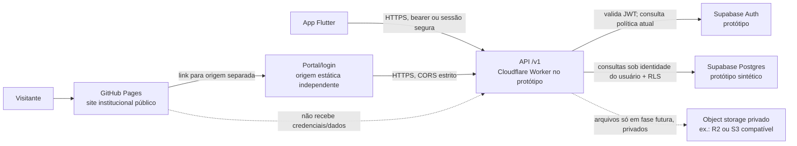

# Arquitetura backend independente — Fala Comigo

**Data:** 25/09/2026  
**Papel:** Arquitetura backend independente  
**Escopo:** arquitetura inicial de baixo custo, migrável e separada do Manus; frontend no GitHub Pages, API, autenticação, banco, armazenamento, ambientes e evolução.  
**Decisão de produto já confirmada:** Opção A — manter o site/interface no GitHub Pages, iniciar backend e banco independentes em camadas gratuitas quando possível e assumir custos somente quando necessários. Este relatório não altera código de produção, não cria conta ou credencial, não contrata serviços e não usa dados reais.

## 1. Conclusão executiva

A Opção A elimina a escolha macro A/B/C, mas ainda não determina se “interface no GitHub Pages” inclui a tela que coleta senha e o portal SaaS. Esse detalhe é **bloqueante**: o GitHub declara oficialmente que Pages não se destina a hospedar gratuitamente um site primariamente de SaaS e que não deve ser usado para transações sensíveis, como envio de senhas ou cartões. A recomendação é interpretar a decisão de modo seguro: **site institucional público no GitHub Pages; interface autenticada/login e portal em outra origem estática independente; API e serviços de dados em origens próprias**. Pages pode encaminhar para o portal, mas não receber senha. Se a intenção for manter também o formulário de login/SaaS no Pages, é preciso resolver a incompatibilidade antes de aceitar credenciais.

Para a fundação técnica, recomenda-se uma **API própria em TypeScript/Hono hospedada em Cloudflare Workers (plano Free no protótipo sintético), Supabase Auth e Postgres para autenticação e banco durante desenvolvimento, sem armazenamento de arquivos no MVP**. O aplicativo/portal não deve acessar tabelas com regras de segurança apenas pela interface: as requisições passam pela API versionada, que valida identidade, organização, vínculo, propósito, consentimento, escopo e prazo; políticas Postgres/RLS fornecem segunda barreira. A API separada, o contrato OpenAPI, migrações SQL padrão e os modelos canônicos existentes preservam caminho para trocar runtime, identidade ou banco.

**O plano gratuito serve para protótipo com dados sintéticos, não para prometer disponibilidade/continuidade com dados familiares reais.** O projeto Supabase Free pode pausar por inatividade, não inclui backup automático na comparação atual e o mecanismo padrão de e-mail é best-effort, limitado a 2 mensagens por hora. Antes de qualquer piloto real, devem existir backup/restauração comprovados, política de retenção/privacidade, canal de e-mail confiável e decisão explícita de custo. Até lá, manter contas, organizações, convites, tarefas e conteúdo conectável apenas sintéticos. A comunicação básica local do app permanece independente.

## 2. Arquitetura alvo recomendada

### Limites de cada camada

1. **GitHub Pages:** páginas públicas institucionais, política, documentação e informações de contato. Não executar backend, persistir sessão ou receber senha. Não colocar chave privada, chave de serviço, segredo de provedor ou lógica de autorização no bundle público.
2. **Portal autenticado:** interface servida em uma origem própria e separada do Pages (temporariamente domínio técnico do provedor até que a compra de domínio seja autorizada). O CTA do Pages só deve apontar para ela quando estiver implantada, testada e aprovada. Enquanto não estiver, o destino atual `https://falacomigo-kyrh225w.manus.space/creator` é dependência legada não aprovada; tratar a transição por PR separada, sem trocar por URL inexistente.
3. **API:** contrato REST versionado `/v1`, documentado em OpenAPI, é a única interface para operações do portal e futuras sincronizações. Começar como monólito modular (identidade/organizações, convites/autorizações, tarefas, auditoria), não microserviços. Regras de acesso são server-side e testadas no servidor.
4. **Autenticação:** Supabase Auth no protótipo elimina a implementação artesanal de hashing, recuperação e sessão. JWT identifica a conta, mas **não** carrega autorização mutável como consentimento, membership e revogação: a API consulta esses estados atuais por requisição. Fluxo web usa PKCE; evitar credenciais e refresh tokens em JavaScript persistente/localStorage. Preferir sessão HttpOnly/Secure/SameSite mediada pelo backend para browser; Flutter guarda credenciais em armazenamento seguro do sistema. MFA é obrigatório para administradores antes de operação real.
5. **Banco:** Supabase Postgres inicialmente; esquema SQL versionado e exportável, UUIDs, enumerações/constraints, migrations repetíveis, `organization_id` em todo recurso organizacional e índices para consultas filtradas. Aplicar menor privilégio, grants e RLS por usuário/organização como defesa em profundidade. Nenhuma tabela fica legível/escrevível só por estar oculta na UI. Nunca distribuir `service_role`/segredo de banco ao cliente. Evitar `SECURITY DEFINER` amplo e consultas admin sem política explícita.
6. **Armazenamento:** **nenhum upload de fotos, vídeos, áudio, diário, cartões personalizados ou arquivo clínico no primeiro MVP**. Guardar só metadados administrativos mínimos/sintéticos. Se documentos forem aprovados em fase posterior, usar bucket privado, nomes de objeto aleatórios, criptografia, validação de tipo/tamanho, antivírus quando aplicável, política de retenção e URLs assinadas curtas emitidas após autorização do servidor. Não sincronizar as caixas Hive nem publicar arquivos em bucket aberto.
7. **Fora do escopo técnico do MVP:** cobrança real, notificações com conteúdo sensível, analytics individual, mídia, prontuário, importação de dados do Manus ou sincronização clínica real.

### Portabilidade que deve ser construída desde o início

- API isolada do frontend por OpenAPI e respostas/códigos estáveis já descritos em `CONTRATO_API_CONTINUIDADE_CUIDADO.md`.
- Regras de domínio puras em módulos de aplicação; SDK específico de provedor só em adaptadores de identidade, persistência, e-mail e objeto.
- SQL/migrations canônicas no repositório; priorizar Postgres padrão e evitar depender de funções/extension proprietárias sem necessidade.
- Exportação periódica testada em formato PostgreSQL/CSV controlado e inventário de objetos com checksum; testar importação em ambiente local limpo.
- Idempotência (`requestId`/`operationId`), versionamento otimista, paginação, timestamps UTC e eventos de auditoria separados de conteúdo.
- API não deve transformar licença patrocinada em autorização: `BenefitEntitlement` e `Consent`/`AccessGrant` permanecem entidades distintas.
- Contratos móveis/web não dependem do nome do provedor; o aplicativo mantém operação local se API, conta, licença, plano gratuito ou conexão falharem.

## 3. Comparação das opções iniciais

| Opção | Trade-offs | Custo inicial | Complexidade de setup |
|---|---|---:|---|
| **A. Supabase integrado (Auth + Postgres + Edge Functions)** | Menos componentes e prototipação rápida; bom encaixe com Postgres e Auth. Mais acoplamento às funções/SDK Supabase; Free pode pausar e não é destino para produção com dados críticos; o portal/login continua fora do GitHub Pages. | US$ 0 para protótipo dentro das cotas; plano pago e SMTP confiável serão necessários conforme disponibilidade/dados reais. | Baixa |
| **B. API Worker própria + Supabase Auth/Postgres (recomendada)** | Separa contrato e runtime do banco/IdP; Worker recebe regra de domínio e padroniza o acesso do Flutter/portal. Mais peças, CORS/segredos/claims e testes de integração; ainda usa Supabase no protótipo. Facilita substituir runtime sem reescrever clientes. | Cloudflare Workers Free + Supabase Free enquanto sintético e dentro das cotas; upgrade quando confiabilidade/backups exigirem. | Média |
| **C. Cloudflare Workers + D1, adicionar Auth/storage próprios ou externos** | Boa cota gratuita e escala por uso, porém D1 é SQLite gerenciado, não Postgres; identidade/e-mail requerem projeto adicional ou implementação cuidadosa. A migração futura para Postgres é possível, mas aumenta adaptação e não oferece vantagem clara para o modelo relacional multi-organização já especificado. | US$ 0 dentro das cotas; cota excedida no Free resulta em erros de serviço até reset/upgrade. | Média/alta |

**Escolha recomendada para implementação, quando autorizada:** B. Se a equipe priorizar a menor quantidade de componentes acima da portabilidade do runtime, A é alternativa aceitável para protótipo, mantendo API/contratos e migrations separados. Não escolher C só pelo rótulo “grátis”: modelo SQLite e autenticação podem deslocar custo para migração/engenharia.

## 4. Fatos atuais consultados em documentação oficial

Valores/limites abaixo foram verificados em documentação oficial em 25/09/2026; cotas e preços podem mudar e devem ser rechecados antes da criação de contas ou mudança de plano.

| Provedor/documentação oficial | Fato relevante para a decisão |
|---|---|
| [GitHub Pages — limites](https://docs.github.com/en/pages/getting-started-with-github-pages/github-pages-limits) | GitHub declara que Pages não é destinado a serviço gratuito de hospedagem para SaaS/negócio online e que não deve ser usado para transações sensíveis, incluindo envio de senhas/cartão. É hospedagem estática; página publicada tem limite de 1 GB, banda “soft” de 100 GB/mês e limite “soft” de 10 builds/hora (com exceção para publicação via GitHub Actions). Isso não é backend nem SLA. |
| [Cloudflare Workers — preços/cotas](https://developers.cloudflare.com/workers/platform/pricing/) (atualizada em 28/08/2026) | Workers Free inclui 100.000 requests/dia e até 10 ms de CPU por invocação. Paid tem mínimo de US$ 5/mês e maior cota inicial. Serve uma API leve de protótipo; controlar CPU, abuso e limites. |
| [Cloudflare D1 — preços](https://developers.cloudflare.com/d1/platform/pricing/) (21/04/2026) | Free inclui 5 milhões de linhas lidas/dia, 100 mil escritas/dia e 5 GB de armazenamento agregado; exceder limites diários no Free faz consultas falharem até o reset ou upgrade. É SQLite, motivo para não ser banco inicial preferido para contratos que já assumem modelo relacional/Postgres. |
| [Cloudflare R2 — preços](https://developers.cloudflare.com/r2/pricing/) (07/08/2026) | Free inclui 10 GB-mês, 1 milhão de operações Classe A/mês, 10 milhões Classe B/mês e egress sem cobrança. É candidato futuro para objetos privados, mas custo zero não substitui política de acesso, retenção, exclusão e cópias de segurança. |
| [Supabase — preços](https://supabase.com/pricing) | Free lista até 50 mil MAU, banco de 500 MB por projeto, 5 GB de egress, 1 GB de arquivos, até 2 projetos ativos e pausa do projeto após uma semana sem atividade; comparação não inclui backup automático. Free é adequado a sandbox sintético, não a promessa de continuidade com dados reais. Rechecar a tabela no momento da adoção. |
| [Supabase — regiões](https://supabase.com/docs/guides/platform/regions) | Região específica `South America (São Paulo), sa-east-1` está disponível. Escolha de região é localização primária, não comprovação de conformidade legal. Decidir antes de criar projeto com dados que exijam localização definida. |
| [Supabase — limites Edge Functions](https://supabase.com/docs/guides/functions/limits) | Free: até 150 s de duração wall-clock, 2 s de CPU por requisição, memória de 256 MB. São funções gerenciadas e há limites de execução; considerar se escolher opção A. |
| [Supabase — senha/e-mail](https://supabase.com/docs/guides/auth/passwords) | Confirmação/reset dependem de e-mail. Serviço SMTP padrão é best-effort e limitado a 2 e-mails/hora; para produção, Supabase recomenda SMTP próprio. Logo, cadastro/recuperação de senha de utilizadores não deve depender do sender de teste. |
| [Render — uso gratuito](https://render.com/docs/free) | A própria documentação diz que instâncias Free não devem ser usadas para aplicações de produção; web service hiberna após 15 min sem tráfego, pode levar cerca de 1 min para acordar; Free Postgres tem 1 GB, expira em 30 dias, sem backups, e após período de tolerância os dados são deletados. Não serve como banco gratuito persistente do portal. |

## 5. Ambientes, dados e operação

### Ambientes mínimos

- **Local:** Supabase local via CLI/Docker ou Postgres local, Mailpit para e-mail de desenvolvimento e dados sintéticos gerados/resetáveis. Sem chaves de produção.
- **CI:** banco descartável efêmero, migrations do zero, fixtures inteiramente sintéticas; testes unitários de autorização e integração API+RLS. Nunca copiar banco, upload, log ou snapshot real.
- **Desenvolvimento remoto:** um único projeto gratuito enquanto sandbox de teste, com `no real data` explícito e rotina de reset; URL e secrets restritos. Como Free limita dois projetos ativos, não presumir dev/staging/prod grátis simultaneamente; local substitui o segundo ambiente de CI.
- **Produção/piloto real:** projeto separado, plano com backups e retenção definidos, SMTP confirmado, domínio/origin próprios, MFA administrativo, monitoramento e orçamento. Não avançar até existir revisão de privacidade/jurídica e aprovação da cobrança. Nenhuma promoção de banco sintético para real por “upgrade” sem revisão e migração controlada.

### Segredos e controle de acesso

- Chaves do Worker, SMTP e qualquer segredo ficam apenas no secret manager do provedor/CI; acesso por menor privilégio, rotação e registro de quem administra.
- `SUPABASE_SERVICE_ROLE`/chave secreta nunca vai para `site/`, build Flutter, issue, log ou commit. Preferir token do usuário propagado e contexto RLS; se uma operação privilegiada excepcional exigir chave, criar função mínima no backend, com teste e auditoria, sem expor o segredo.
- CORS permite apenas os origins conhecidos do portal/app web; `OPTIONS`/métodos/origens são testados. Para cookie, usar `Secure`, `HttpOnly`, `SameSite` e proteção CSRF; não usar wildcard com credenciais.
- Rate limit de login, convite, recuperação, upload e operações administrativas; respostas de negação não revelam se outro sujeito/organização existe. Não registrar corpo, frases, nome de criança, mídia, token ou password.
- Alertas de consumo, quota, error rate e indisponibilidade sem payload sensível. Limite de gastos/upgrade precisa ser decidido antes de adicionar método de pagamento.

## 6. Conflitos, requisitos bloqueantes e decisões pendentes

1. **Pages versus tela autenticada — bloqueador P0.** A decisão fala “site e interface no Pages”; documentação oficial do GitHub não recomenda coleta/envio de senha ou hospedar SaaS no Pages. Alinhar que apenas a presença institucional/entrada fica lá e que tela de login/portal terá origem independente, ou rever oficialmente a interpretação antes de implementar login. HTTPS/API externa não elimina o problema de colocar o formulário de senha em Pages.
2. **CTA público ainda aponta ao Manus — incompatibilidade de destino.** `site/index.html` mantém `https://falacomigo-kyrh225w.manus.space/creator`; a continuidade diz que proprietário não quer Manus. A troca de link é publicação pública e só deve ocorrer em PR. Até haver destino seguro, proposta é CTA informativo “Portal em migração/em desenvolvimento” ou temporariamente desativado, não uma URL falsa. Registrar eventual período de transição explicitamente.
3. **Especificação não é implementação.** `CONTRATO_PORTAL_CONECTADO.md`, `CONTRATO_API_CONTINUIDADE_CUIDADO.md` e contratos RH definem entidades e autorização, mas `PROJECT_HANDOFF.md` afirma que backend, contas/organizações e autorização remota não estão implementados. Não declarar portal independente pronto e não reutilizar serviço/segredo/dado do Manus.
4. **Política de privacidade descreve comportamento atual local-only.** `privacy_policy.html` declara que dados de perfil, ABC e mídia ficam apenas locais e que não há upload automático. Quando alguma conta ou sincronização for realmente introduzida, conteúdo de privacidade/termos, finalidades, destinatários, retenção, consentimento, exclusão, controlador/operador e suporte precisam ser revistos antes do fluxo real. Não contradizer a política atual por protótipo.
5. **Escopo do MVP indefinido.** `SEQUENCIA_FULL_STACK_ATE_PILOTO.md` separa console do proprietário, identidade multi-organização, convites e portal sem dados clínicos em fases diferentes. É necessário escolher se primeira fatia é só login/console administrativo sintético ou já inclui organização/membership. Recomenda-se começar pelo console/gestão de organização e licenças de teste, sem perfil de criança, anexos, dados clínicos, pagamento ou sincronização.
6. **Cotas grátis conflitam com promessa de continuidade.** Supabase pode pausar no Free e não listar backup automático; Render free Postgres expira e apaga após 30+14 dias. “Gratuito” significa tolerável para protótipo descartável, não serviço de produção/arquivo de famílias. Gatilho de pagamento deve ser disponibilidade, suporte, backup/restore, SMTP e dados reais, antes de simples volume/limite.
7. **Identidade de proprietário/recuperação não está fechada operacionalmente.** `falacomigocaa@gmail.com` aparece como e-mail desejado; não existe login próprio pronto e nenhuma credencial deve ser criada/documentada aqui. Definir bootstrap seguro (convite individual, confirmação de e-mail, MFA, recovery) e titularidade da conta do provedor, sem senha compartilhada.
8. **Região e residência de dados.** São Paulo pode ser boa candidata para latência e região do banco, mas localização não é parecer de conformidade. Confirmar retenção/região com análise de privacidade antes de projeto com dados reais; região e exportação devem fazer parte da decisão de fornecedor.
9. **Banco versus autorização.** Evitar tratar JWT/grupo ou esconder botão como permissão. O estado de consentimento, validade, revogação e vínculo deve ser consultado no servidor/banco atual em cada acesso; revogação impede a próxima leitura, e objetos também exigem authorization no download.
10. **Portabilidade e desligamento incompletos.** Além de formato de exportação, definir periodicidade, criptografia/custódia, teste de restauração, forma de trocar URL/API, rotação de tokens e eliminação verificável do provedor anterior. “Postgres” por si só não comprova migração sem ensaio.
11. **Armazenamento de documentos não deve antecipar o produto.** Fotos/vídeos são categoria de risco e custo superior. A área de arquivos deve continuar ausente no primeiro corte; aprovação separada define tipos, limites, finalidade, retenção, expiração e resposta a revogação.
12. **Nome Opção A é ambíguo no repositório.** Alguns branches antigos chamam “Opção A” a alternativa de layout do dashboard parental. Em documentos de infraestrutura, escrever sempre “Opção A — Pages público + backend/banco independentes”.

## 7. Recomendação de evolução e gates

### Fase 0 — decisão e desenho, sem contas novas

- Registrar ADR de arquitetura, confirmar interpretação Pages/login, escopo MVP e política provisória do CTA.
- Harmonizar documentação de continuidade: decisão A já tomada; provedor técnico ainda sujeito à pesquisa/aprovação; portal Manus é destino legado, não arquitetura aceita.
- Especificar usuários administrativos individuais, recuperação, MFA, ambientes, política de segredos, ameaça, dados permitidos e dados explicitamente proibidos.
- Criar OpenAPI para subconjunto de endpoints e tabela de dados/campos mínimos; não implementar sincronização clínica.

### Fase 1 — protótipo independente com dados sintéticos

- Quando houver aprovação operacional, criar ambiente sob titularidade do proprietário em provedores independentes do Manus; escolher opção B proposta, com região avaliada.
- Hospedar API REST pequena; implementar health/version sem dados, autenticação do proprietário, organização demo e audit event administrativo mínimo.
- Aplicar migrations, autorização/RLS e logs mínimos; rodar local/CI + um ambiente remoto sintético.
- Usar origens técnicas de teste; nenhuma chave privilegiada no Pages/portal.
- Automatizar reset de dados e demonstrar como exportar e restaurar do zero.

### Fase 2 — autorização, apenas dados de demonstração

- Implementar convites expiráveis, membership, AccessGrant/Consent por finalidade, revogação e auditoria antes de tarefas/perfis compartilhados.
- Automatizar os 15 testes de negação de `CONTRATO_API_CONTINUIDADE_CUIDADO.md` e matriz RH; adicionar cross-tenant tests com duas organizações sintéticas.
- Validar sessão encerrada/expirada, token roubado hipotético, idempotência, concorrência/version conflict, rate limiting e falha de dependência.
- Corrigir privacidade e copy pública apenas em PR revisada. Não habilitar conteúdo real só porque o happy path funciona.

### Fase 3 — piloto real condicionado

Entrar somente com aprovação explícita, política/legal revisada, contas/contratos/encarregado e suporte definidos, plano com backup operacional, restauração ensaiada, região aprovada, SMTP confiável, expiração/exclusão e incident response testados. Primeiro release conectado limita-se a mínimo funcional escolhido; núcleo offline/CAA não pode ser bloqueado por serviço, plano, revogação ou falta de internet.

### Gatilhos para sair do gratuito

Aprovar upgrade **antes** de: colocar qualquer dado familiar/clínico no serviço; precisar de disponibilidade sem suspensão; retenção de backup maior ou restauração garantida; e-mail de autenticação/recuperação além da cota de teste; superar limite de API/armazenamento/banda; ou permitir piloto/instituição fora do ambiente de demonstração. Definir alerta de cota, teto mensal, aprovador de cobrança e plano de contingência. Não esperar a cota acabar para migrar dados sensíveis.

## 8. Primeiras ações concretas

1. Usar este relatório como referência de arquitetura e **não reapresentar escolha A/B/C**.
2. Resolver o bloqueio GitHub Pages: confirmar por escrito que formulário/login/portal SaaS será servido fora do Pages; manter no Pages apenas site institucional e link/encaminhamento.
3. Abrir, separadamente, PR de continuidade/publicação para resolver CTA legado do Manus com estado “portal em desenvolvimento/migração”, sem apontar para destino inexistente nem mudar esta arquitetura via deploy direto.
4. Escolher e registrar MVP: **console do proprietário + organizações/licenças sintéticas**, sem perfis de criança, arquivos, consentimento clínico ativo, cobrança ou sync; identificar qualquer exceção antes de código.
5. Aprovar tecnicamente a opção B (Worker como API, Supabase Auth/Postgres Free apenas para dev sintético) ou registrar razão para opção A integrada; não criar contas nesta tarefa. Validar as cotas oficiais novamente no dia da contratação.
6. Preparar ADR/OpenAPI/diagrama lógico de tabelas, matriz de classificação/retention, threat model e fluxo de bootstrap/recuperação/MFA do proprietário; usar e-mail administrativo escolhido sem incluir senha no Git.
7. Implementar localmente e em branch, em sequência: migrations e fixtures sintéticas → auth/API → RLS e autorização → testes negativos → CI → exportação e restore. Nenhum dado real nos testes ou logs.
8. Decidir ambiente/região: local e CI descartável; um único sandbox remoto sintético gratuito; produção separada e paga apenas quando os gates de disponibilidade/dados exigirem. Confirmar `sa-east-1` como candidata, não conclusão legal.
9. Definir threshold de upgrade, teto de gasto, aprovador, monitoramento de uso, janela de indisponibilidade e plano de saída antes de habilitar faturamento.
10. Só após implantação independente, checks verdes, testes de negação e validação visual/privacidade, mudar CTA por PR + workflow `site-pages.yml` e conferir o destino publicado. Nenhum serviço Manus deve permanecer como dependência do Criador.

## 9. Referências de projeto analisadas

- `CONTINUAR_AQUI_PRIMEIRO.md` — decisão Opção A, limitação do Pages, CTA legado e segurança.
- `PROMPT_RETORNO_NOVO_AGENTE.md` — sequência de retomada e distinção de fases.
- `AGENTS.md` — prioridade local-first, segurança e bloqueios para cobrança/serviços.
- `PROJECT_HANDOFF.md` — funcionalidades existentes e itens de backend ainda ausentes.
- `docs/CONTINUIDADE_ASSISTENTE_IA.md` e `docs/equipe-mestra/01-git-continuity.md` — contradições documentais/estado do site e portal.
- `docs/CONTRATO_PORTAL_CONECTADO.md`, `docs/CONTRATO_API_CONTINUIDADE_CUIDADO.md`, `docs/CONTRATO_PORTAL_RH_AUTORIZACAO.md` — entidades, endpoints, autorização, idempotência e testes de negação.
- `docs/MODELO_AUTORIZACAO_CLINICAS_ESCOLAS.md`, `docs/MODELO_CUSTOS_E_PLANOS.md`, `docs/PLANO_PORTAL_CUIDADO_CONECTADO.md`, `docs/SEQUENCIA_FULL_STACK_ATE_PILOTO.md`, `docs/RH_AUDITORIA_E_RETENCAO.md` — finalidade, retenção, evolução e gates.
- `privacy_policy.html` — afirmação atual de armazenamento local-only, que deverá ser revista antes de qualquer envio remoto.

**Limites desta análise:** não verifiquei conta ou projeto real em Cloudflare/Supabase/Render, contrato, disponibilidade operacional, execução de portal externo, nem políticas fiscais/jurídicas. Nenhum endpoint/serviço foi implantado. Preços/limites reportados são citações das páginas oficiais ligadas, sujeito a mudança. O registro do repositório já apontava CTA Manus; este trabalho não o alterou.